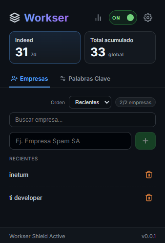
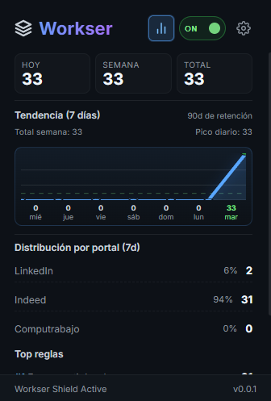
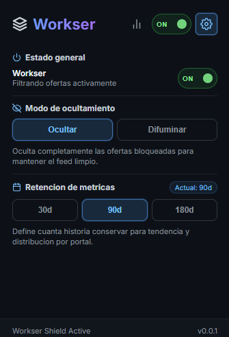

# Workser

Extensión para filtrar ofertas de empleo por empresas y palabras clave en portales como LinkedIn, Indeed y Computrabajo.

## Qué hace

- Oculta o difumina ofertas según reglas configuradas.
- Permite activar/desactivar Workser rápidamente.
- Incluye métricas de impacto (hoy, semana, total).
- Muestra tendencia de 7 días, distribución por portal y top reglas.
- Soporta búsqueda, edición inline, orden y agrupación de reglas.

## Capturas (placeholders)

> Puedes reemplazar estas imágenes por las tuyas y mantener la misma ruta.

### Vista principal (Filtros)



### Vista de analíticas



### Vista de configuración



## Estructura sugerida para imágenes

```text
docs/
  images/
    filters.png
    analytics.png
    settings.png
```

## Stack

- WXT
- React
- TypeScript

## Desarrollo local

```bash
pnpm install
pnpm dev
```

## Build y ZIP para release

```bash
pnpm build
pnpm zip
```

El ZIP generado para publicar en GitHub Releases queda en:

`./.output/wxt-react-starter-<version>-chrome.zip`

## Cargar extensión manualmente

1. Abre `chrome://extensions` o `edge://extensions`.
2. Activa `Developer mode`.
3. Click en `Load unpacked`.
4. Selecciona `./.output/chrome-mv3` (o `./.output/chrome-mv3-dev` en desarrollo).

## Roadmap corto

- Importar/exportar configuración.
- Whitelist (lista permitida).
- Optimización de escaneo en páginas dinámicas.
